# Comprehensive mind map — SUPIN testing framework + MI-M-T cohesion + beyond — v0.1 CS

> **Trigger.** CP-SUPIN-04 STEP 33 (2026-05-06): Pete EOD direction —
> "comprehensive mind map of the SUPIN framework as well as cohesion
> to the MI-M-T and beyond projects where we find implications and
> overlaps, to lessons learned and to tools available as well as for
> Architecture map and Risk assessment."
>
> **Audience.** Pete (across all 3 devices), MI-M-T project, governance.
> **Účel.** Single artefakt, který spojuje vše současné, jeho překryvy,
> rizika, použité nástroje a buduje cestu k MI-M-T (a beyond).

---

## §1. Top-level mind map

```mermaid
mindmap
  root((SUPIN<br/>test ekosystém<br/>2026-05-06))
    Bouračka calibration
      4 environments
        DEMO_PROD demo.bouracka.cz
          Cíl 1 ✅ live
          Suite v0.4.6 GREEN
        DEMO_tst tst.demo.bouracka.cz
          Cíl 2 🔄 cloning
          Parametrized BOURACKA_BASE
        PROD_tst tst.bouracka.cz
          Cíl 3 ⏳ gated
          N08 + AISPOV + zenID needed
        PROD bouracka.cz
          Cíl 4 ⏳ prelive only
          Read-only smoke
      Test layers
        F E browser-driven
          Playwright primary
          Cypress secondary
          TestCafe tertiary
        B E service contract
          ReadyAPI SoapUI primary
          Postman secondary
          Selenium alt robust
        Cross-layer E2E
          Selenium WebDriver
        Mock layer
          Mockoon
      Per-system findings
        9 integrations cataloged
          INT-001 reCAPTCHA v3
          INT-002 N08 SMS Gateway
          INT-003 AISPOV ROB
          INT-004 AISPOV CRR
          INT-005 zenID OCR
          INT-006 Azure outage feed NEW
          INT-007 Google Maps NEW
          INT-008 internal /api/reports NEW
          INT-009 ČÚZK RUIAN NEW
        7 codelists captured
          insurance 13
          vehicle brands 275
          ŘP categories 17
          damage zones 8
          movement types 18
          accident types 5
          culprit options 3
        Δ matrix 26 rows
          8 confirmed live
        4 wizard phases
          Replaces 18-screen taxonomy
    SUPIN ecosystem map
      Bottom-up reverse engineering
        Fragment-driven
          Source citation rule
          Confidence tagging
          Drift handling
      Archimate UML
        Business layer
          Actors 5
          Processes 5
          Services TBD
        Application layer
          Components per system
          Interfaces SOAP REST
          Data objects
        Technology layer
          Nodes networks
      Systems registry
        Bouračka first
          F E heavy atypical
          Calibration case
        X1 placeholder
          B E heavy typical
          SOAP REST combinatorial
        X2 to XN TBD
      Cross-cutting
        Shared interfaces
          AISPOV all 3 registries
          N08 SMS Gateway
          ČÚZK RUIAN
          zenID
        Domain entities
          Občan OP ŘP
          Vozidlo SPZ VIN
          Pojištění
          Nehoda záznam
      V-model alignment
        Acceptance to BPM UC
        System to Application
        Integration to Component
        Unit to Technology
    MI-M-T project
      What we feed it
        Methodology
          Branch-aware schema
          Single master multi-view
          Bug dedup convention
          Recovery as code
          Δ matrix pattern
          Empirical preflight
        Tools as modules
          check_priority_matrix
          bump_workbook_version
          render_branch_doc
          test_console
          excel-row-writer reporter
        Schema standards
          ItemBase structure
          env_constraints column
          applies_to_DEMO PROD
          BUG naming pattern
      What MI-M-T provides
        Live workbook bridge
          Q1 2027 target
        Component module hosting
        Unified runner backend
        Cross-project governance
      Migration path
        Q3 2026 framework freeze
        Q4 2026 first ports
        Q1 2027 live bridge
        Q2 2027 full migration
    Beyond projects
      Other ČKP systems
        TBD per SUPIN backlog
      Multi-tenant SaaS testing
        Same branch tagging pattern
      Governance reuse
        Bug dedup pattern
        Excel-based or live bridge
    Tools available
      Already built
        validate_workbook
        check_priority_matrix
        fix_priority_matrix
        bump_workbook_version
        migrate_to_v04 v04_1 v04_2
        render_branch_doc
        sanity-check
        append_test_run_result
        test_console
        excel-row-writer
        render-uml
        heic-to-jpg
        build_mindmaps
      External
        winget Python Node JDK
        npm Playwright Cypress TestCafe
        SoapUI ReadyAPI
        Postman Newman
        Selenium webdriver
        Mockoon
        PlantUML
    Lessons learned
      Install gotchas 6
        winget source reset
        ExecutionPolicy
        Python.exe stub
        pip.exe Scripts PATH
        PATH snapshot
        Missing files in ZIP
      Test author gotchas 8
        Cookie banner first visit
        OTP React-controlled inputs
        DEMO any 4-digit
        validate=false hook
        MUI Autocomplete pattern
        RUIAN 3-char trigger
        Geolocation timeout
        BUG naming dedup
      Methodology learnings
        Live SUT > stale doc
        Bottom-up before top-down
        Recovery patterns inline
        Δ matrix as audit trail
        Empirical preflight
    Risks
      Blocked
        N08-test sandbox
        AISPOV access
        zenID test-keys
        VPN to tst envs
      Drift risk
        Stale analytical doc
        Bouračka SUT changes
        Excel formula bugs
      Operational
        Single point Pete
        SUPIN infra unavailable
        Email scanner strip
        BOM-less encoding
      Strategic
        Multi-framework decision late
        Excel framework freeze timing
        MI-M-T readiness
    Three devices
      ThinkPad now
        Pete Opus session
        Governance
        Test execution
      MacBook
        Analytical MI-M-T session
        Methodology export
      HP Elite
        SUPIN internal network
        No Claude sessions
        Test on real intranet
```



## §2. Implications across projects

### §2.1 Bouračka → MI-M-T overlaps

| Bouračka artifact | MI-M-T equivalent (target) | Implication |
|-------------------|------------------------------|-------------|
| Excel `01_TestTargets` / `02_TestCases` schema | MI-M-T live workbook entity | Excel must be import-ready (column conventions stable) |
| `BUG-CP-{TC}-{ASSERT}` naming | MI-M-T defect dedup module | MI-M-T should adopt same key-pattern |
| `applies_to_demo`/`applies_to_prod` boolean cols | MI-M-T multi-tenant tagging | Same pattern, generalized to N dimensions |
| `<!-- B:DEMO --> ... <!-- /B -->` markers | MI-M-T documentation render module | Single-master pattern proven; ready to port |
| `Δ matrix` confidence tagging | MI-M-T cross-env audit trail | Adopt directly |
| `tools/test_console.py` | MI-M-T runner backend | Convert to module; framework registry |
| `tools/check_priority_matrix.py` | MI-M-T validator module | Adopt as one of N validators |
| `recon/integrations/INT-NNN.md` format | MI-M-T integration registry | Adopt structure |
| `archimate/*.puml` (sketch) | MI-M-T architecture module | Need dedicated UI; Bouračka has only static .puml |

### §2.2 SUPIN-ecosystem-map → MI-M-T overlaps

| Ecosystem map element | MI-M-T equivalent | Implication |
|------------------------|---------------------|-------------|
| `_governance/METHODOLOGY-CS.md` | MI-M-T governance template | Adopt 8 rules |
| `_governance/PARAMETRIZATION-CS.md` (env+release tags) | MI-M-T variation engine | Same pattern, generalized |
| `_governance/FRAGMENT-INGESTION-CS.md` | MI-M-T evidence-driven docs | Pattern works; needs UI for ingestion |
| `systems/{NN-system}/system.md` fact-sheet schema | MI-M-T entity schema | Direct port |
| `interfaces/{KIND}/{name}.md` per-interface | MI-M-T interface registry | Direct port |
| `v-model/V-MODEL-MAPPING-CS.md` test-anchor mapping | MI-M-T traceability matrix | Adopt; key for V-model compliance |

### §2.3 Bouračka ↔ Future SUPIN systems (X1, X2…)

| Pattern from Bouračka | Reusable for X1+? | Notes |
|------------------------|---------------------|-------|
| 4-target pipeline (DEMO_PROD/DEMO_tst/PROD/PROD_tst) | YES — universal | Same quad applies to most SUPIN |
| Multi-platform test stack | YES | But X1 likely heavy on ReadyAPI vs Playwright |
| Branch tagging Excel cols | YES — direct port | X1 worksheet inherits |
| Bug naming convention | YES — direct port | universal pattern |
| Recovery patterns inline | YES — direct port | helps follower onboarding for X1 |
| Cookie banner helper | NO — Bouračka-specific (F/E only) | X1 won't have UI cookies |
| OTP React-controlled inputs | NO — Bouračka-specific | X1 likely has SOAP auth tokens |
| RUIAN address autocomplete | YES — if X1 also has address fields | Common Czech-state data |

## §3. Risk assessment matrix

| Risk | Severity | Urgency | Priority (sev × urg) | Mitigation |
|------|----------|---------|----------------------|------------|
| N08-test sandbox not delivered | A | A | A | Mockoon profile already in repo; partial coverage; escalate to ČKP IT |
| Pete is single point of dev | A | B | A | Multi-device plan (§5); MacBook sync; eventual Sonnet sessions |
| SUPIN internal Git not accessible | B | B | B | GitHub strategy (independence rule); no blocking dep |
| Bouračka SUT drift between iterations | A | C | B | Δ matrix as audit; live recon every iteration |
| Email scanner strips ZIP | C | C | D | Multiple delivery channels (SharePoint backup); inline heredoc recovery |
| Excel framework freeze pre-MI-M-T | B | D | D | Schema versioning; explicit migration scripts |
| Multi-framework decision delayed | B | D | D | Parallel dev; decision point at CP-SUPIN-05 |
| Stale analytical doc resurfaces | C | C | D | Source-of-truth tier model in DOCUMENTATION-POLICY |

## §4. Tools coverage map

```
Tool                            | F/E  | B/E  | Dom  | Doc  | Excel | CI
─────────────────────────────────|──────|──────|──────|──────|───────|────
Playwright                       | ★★★  | ★    | -    | -    | -     | ✓
Cypress                          | ★★★  | -    | -    | -    | -     | ✓
TestCafe                         | ★★   | -    | -    | -    | -     | ✓
ReadyAPI/SoapUI                  | -    | ★★★  | -    | -    | -     | ✓
Postman/Newman                   | -    | ★★★  | -    | -    | -     | ✓
Selenium WebDriver               | ★★★  | ★    | -    | -    | -     | ✓
Mockoon                          | -    | ★★   | -    | -    | -     | ✓
test_console.py (orchestration)  | ★    | ★    | -    | -    | ✓     | ✓
excel-row-writer reporter        | ★    | ★    | -    | -    | ★★★   | ✓
check_priority_matrix.py         | -    | -    | -    | ✓    | ★★★   | ✓
render_branch_doc.py             | -    | -    | -    | ★★★  | -     | -
PlantUML                         | -    | -    | -    | ★★   | -     | -
build_mindmaps.py                | -    | -    | -    | ★★   | -     | -
heic-to-jpg                      | -    | -    | -    | ✓    | -     | -

Legend: ★★★ primary tool, ★★ good fit, ★ usable, ✓ supports, - n/a
Dom = Domain modeling.  Doc = Documentation.  CI = CI integration ready.
```

## §5. Architecture map cross-link

| Layer (Archimate) | SUPIN-ecosystem-map artefact | Bouračka-tests artefact |
|-------------------|-------------------------------|-----------------------------|
| Motivation | (TBD goals/drivers) | (TBD via SUPIN governance review) |
| Strategy | `archimate/strategy/` | `_specs/ROADMAP-4-TARGET-CS.md` |
| Business | `archimate/business/supin-ecosystem-overview.puml` | `recon/screenflows-live/flow-A1-main-tst-demo/uml/use-case.puml` |
| Application | `archimate/application/bouracka-component.puml` | `recon/integrations/INT-001..009.md`, `_specs/MULTI-PLATFORM-TESTING-STRATEGY` |
| Technology | (TBD per environment) | `recon/screenflows-live/flow-A1-main-tst-demo/uml/sequence.puml` |

## §6. Lessons learned by category

### §6.1 Install / setup (6 gotchas)

Per `_install/INSTALL-FROM-ZERO-v0.4-CS.md` §13:
1. winget source reset preflight
2. PowerShell ExecutionPolicy preflight
3. Python.exe MS Store stub → use `py`
4. Pip.exe Scripts not on PATH → use `py -m pip`
5. PATH snapshot in current shell → refresh / new shell
6. ZIP extract may miss files → recovery patterns inline

### §6.2 Test author (8 gotchas)

Per `_specs/TESTER-LESSONS-LEARNED-v0.1-CS.md`:
1. Cookie banner blocks rozcestník H1 on fresh session
2. OTP inputs are React-controlled — fill() insufficient
3. DEMO accepts any 4-digit OTP → use constant, no SUT load
4. `?validate=false` automation hook on Phase 2 manual
5. MUI Autocomplete pattern → `[role="listbox"] [role="option"]`
6. RUIAN address autocomplete needs ≥3 chars
7. Geolocation timeout in headless → grant permission OR dismiss
8. Bug naming dedup convention (BUG-CP-TC-ASSERT)

### §6.3 Methodology

Per multiple specs:
1. Live SUT > stale analytical doc — always reverse from live
2. Bottom-up before top-down — fragments accrete to architecture
3. Recovery as code — inline heredocs in install guide
4. Δ matrix as audit trail — env behavior diffs are first-class
5. Empirical preflight — promote known gotchas to main flow, not troubleshoot

### §6.4 Strategic

Per `_specs/ROADMAP-4-TARGET-CS.md` + `MULTI-PLATFORM-TESTING-STRATEGY`:
1. 4-target gradual delivery (DEMO_PROD → DEMO_tst → PROD_tst → PROD prelive)
2. Multi-platform parallel — gather evidence before deciding
3. GitHub independence — no SUPIN-infra blocking dependency
4. Excel-then-MI-M-T migration timing (Q3 2026 freeze, Q4 first ports)
5. Calibration case approach: Bouračka simplest first, X1 typical next

## §7. Open governance questions (refresh from ROADMAP §6)

| # | Question | Owner | Status (2026-05-06 EOD) |
|---|----------|-------|--------------------------|
| Q1 | Excel framework freeze timing? | SUPIN architects | open |
| Q2 | MI-M-T tech-owner for Bouračka import? | SUPIN | TBA |
| Q3 | N08-test sandbox delivery? | ČKP IT (OQ-CP-27) | pending |
| Q4 | Tester laptop pool — single ThinkPad or multi? | SUPIN OPS | now 3-device (ThinkPad + MacBook + HP Elite) |
| Q5 | MacBook sync frequency? | Pete | per Opus iteration |
| Q6 | First Sonnet session start? | Pete | after CP-SUPIN-05 prep |
| Q7 (NEW) | GitHub repo creation? | Pete | per CP-SUPIN-04 STEP 32 strategy |
| Q8 (NEW) | HP Elite SUPIN-internal posture? | Pete + SUPIN OPS | TBD next session |

## §8. Status

| Item | Hodnota |
|------|---------|
| Mind map | `_specs/COMPREHENSIVE-MIND-MAP-SUPIN-MIMT-v0.1-CS.md` |
| Verze | v0.1 |
| Datum | 2026-05-06 EOD |
| Audience | Pete (3 devices), MI-M-T project, governance |
| Companion | ROADMAP-4-TARGET-CS, MULTI-PLATFORM-TESTING-STRATEGY, GITHUB-SYNC-STRATEGY, all install/lessons docs |
| Status | session-close artefakt; refresh per major milestone |
