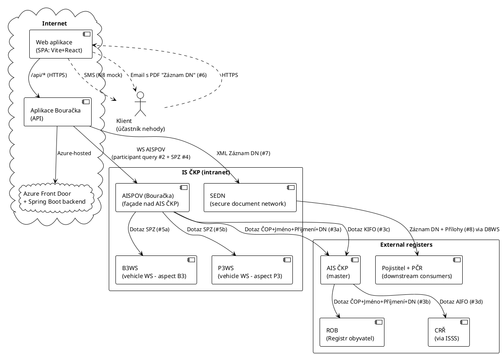

# Bouračka — celková architektura + 8 datových toků — v0.1 CS

> **Source.** Architecture diagram poskytnut Pete 2026-05-07 EOD (CP-SUPIN-05).
> Reverse-engineered Pete-side z analytical doc + interní ČKP zdrojů.
>
> **Audience.** Pete + governance + Sonnet branch sessions (test scope) + ČKP IT.
> **Cíl.** Tato doc kanonizuje architekturu na úrovni komponent + 8 numbered
> data flows; doplňuje a v některých bodech opravuje předchozí
> `recon/integrations/` katalog.

---

## §1. Top-level architecture (PlantUML)



ASCII fallback (pokud PlantUML render selže):

```
                                   ┌──────────────────────────┐
                                   │       Klient             │
                                   │  (účastník nehody)       │
                                   └──┬───┬───────────┬───────┘
                            HTTPS     │   │ SMS (N8)  │ Email + PDF (#6)
                                      ▼   │           │
                                  ┌─────────┐         │
                                  │   Web   │         │
                                  │   App   │         │
                                  │ (SPA)   │         │
                                  └────┬────┘         │
                                       │              │
                                       │ /api/*       │
                                       ▼              │
                                  ┌──────────────┐    │
                                  │  Aplikace    │────┘
                                  │  Bouračka    │
                                  │  (Azure)     │──── XML Záznam DN (#7) ──┐
                                  └──┬─────────┬─┘                          │
                              WS    │         │  WS                          ▼
                              AISPOV│         │  AISPOV       ┌──────────────────────┐
                              (#2 ČOP)        │  (#4 SPZ)      │     IS ČKP           │
                                    │         │                │                      │
                                    │         │                │  ┌──────────────┐    │
                                    └────┬────┘                │  │    SEDN      │    │
                                         ▼                     │  └──────┬───────┘    │
                                  ┌────────────┐               │         │            │
                                  │  AISPOV    │───── #5a SPZ ──── B3WS  │            │
                                  │ (Bouračka) │                │  ┌─────┘            │
                                  └─┬─────┬────┘─── #5b SPZ ──── P3WS                 │
                                    │     │                     │                      │
                          #3a ČOP+  │     │ #3c KIFO            │                      │
                          Jméno+P+DN│     │                     │                      │
                                    ▼     ▼                     │                      │
                              ┌──────────────┐                  │                      │
                              │  AIS ČKP     │ #3d AIFO ──→ CRŘ (ISSS)                │
                              │  (master)    │                  │                      │
                              └──────┬───────┘                  │                      │
                                     │ #3b ČOP+...              │                      │
                                     ▼                          │                      │
                                  ┌─────┐                       └──────────┬───────────┘
                                  │ ROB │                                  │
                                  └─────┘                       D8WS via SEDN  #8
                                                                            │
                                                                            ▼
                                                              ┌──────────────────┐
                                                              │ Pojistitel + PČR │
                                                              └──────────────────┘
```

## §2. Eight numbered data flows — kanonický katalog

Z architektury je 8 numbered document/data flows. Tabulka mapuje každý na
existing recon (`recon/integrations/INT-*.md`) + Excel TT codes:

| # | Flow | Direction | Payload | Existing INT | Mapping na assembly TT |
|---|------|-----------|---------|--------------|-----------------------|
| 1 | Záznam DN (UI render) | Web app → Klient | rendered HTML/PDF on `/success` screen | INT-008 (/api/reports) | TT-SCRN-success, TT-FUNC-001 |
| 2 | Dotaz: ČOP + Jméno + Příjmení + DN | Web app → AISPOV (WS AISPOV) | participant identification probe | INT-002 AISPOV (existing) | TT-FUNC-002 |
| 3a | Dotaz: ČOP + Jméno + Příjmení + DN | AISPOV → AIS ČKP | identity forwarding | (nový → INT-010 AIS ČKP) | (nový TT-FUNC-002a) |
| 3b | Dotaz: ČOP + Jméno + Příjmení + DN | AIS ČKP → ROB | population registry lookup | (nový → INT-011 ROB) | (interní; netransparentní pro klienta) |
| 3c | Dotaz: KIFO | AISPOV → AIS ČKP | KIFO = "Klientský identifikátor fyzické osoby" v ČKP | (nový → INT-010) | (interní) |
| 3d | Dotaz: AIFO | AIS ČKP → CRŘ (ISSS) | AIFO = "Agendový identifikátor fyzické osoby" via ISSS | (nový → INT-012 CRŘ) | (interní) |
| 4 | Dotaz: SPZ | Web app → AISPOV (WS AISPOV) | vehicle license plate query (Azure-hosted) | INT-002 AISPOV (existing) | TT-FUNC-003, TT-ACTV-autocomplete-brand |
| 5a | Dotaz: SPZ | AISPOV → B3WS | "B3" aspect — Bouračka backend WS for vehicle | (nový → INT-013 B3WS/P3WS) | (interní) |
| 5b | Dotaz: SPZ | AISPOV → P3WS | "P3" aspect — Pojistitel backend WS for vehicle | (nový → INT-013) | (interní) |
| 6 | PDF Záznam DN | Web app → Klient | finalized PDF doručený e-mailem | INT-005 (e-mail dispatch) | TT-FUNC-005, TT-SCRN-success |
| 7 | XML Záznam DN | Aplikace Bouračka → SEDN | XML record do Secure Electronic Document Network | (nový → INT-014 SEDN) | TT-FUNC-005 |
| 8 | Záznam DN + Přílohy | SEDN → Pojistitel + PČR | finalized record + attachments via D8WS | (nový → INT-015 D8WS) | (downstream; mimo Bouračka SUT) |

## §3. New components identified — diff vs CP-SUPIN-04 closure

Architektura odhaluje **6 nových komponent** které dosud nebyly v
`recon/integrations/` katalog:

### §3.1 IS ČKP internal komponenty (4)

| Komponenta | Role | Předchozí znalost | Test impact |
|------------|------|-------------------|-------------|
| **AISPOV (Bouračka)** | Façade nad AIS ČKP, specifická pro Bouračka use case | částečně známo (INT-002) | confirmed; on PROD klíč pro identity verification |
| **AIS ČKP** | MASTER ČKP information system | nový | downstream, neakcessible přímo z Web app |
| **B3WS** | "B3" vehicle webservice (aspect Bouračka) | nový | interní; není přímo testovaný E2E |
| **P3WS** | "P3" vehicle webservice (aspect Pojistitel) | nový | interní; není přímo testovaný E2E |
| **SEDN** | Secure Electronic Document Network — finalized record routing | nový (zmíněno N8/SMS, ale SEDN je separate) | testovatelné jen indirectně přes outbound (success → email/PDF) |

### §3.2 Externí registry (3)

| Komponenta | Role | Test impact |
|------------|------|-------------|
| **ROB** (Registr Obyvatel) | Czech Population Registry | accessed via AIS ČKP; netestováno přímo |
| **CRŘ** (Centrální Registr Řidičů) via **ISSS** | Czech Driver Registry via Information System for State Services | accessed via AIS ČKP, ne přímo |
| **Pojistitel + PČR** | Downstream consumers (insurance + Czech Police) | mimo SUT scope |

### §3.3 Specifické identifikátory

Architektura používá tři distinct identifikátory pro fyzickou osobu:

| Zkratka | Význam | Použití | Visible v Web App? |
|---------|--------|---------|---------------------|
| **ČOP** | Číslo občanského průkazu (CZ ID number) | Dotaz #2 + #3a + #3b | ano — SPA field |
| **AIFO** | Agendový identifikátor fyzické osoby (state-wide ID) | Dotaz #3d | NE — internal |
| **KIFO** | Klientský identifikátor fyzické osoby (ČKP-internal) | Dotaz #3c | NE — internal |

Pro testing scope: Web App vidí jen **ČOP** (formát `123456789` = 9 digit). KIFO + AIFO jsou ČKP-internal lookup keys, neexponované klientovi.

## §4. Updates to existing INT docs

### §4.1 INT-002 (AISPOV) — refresh

Existing INT-002 popisuje "AISPOV registry". Ve skutečnosti existují dva
distinct AISPOV components:

- **AISPOV (Bouračka)** — façade in IS ČKP exposed to Web App via WS AISPOV
- **AIS ČKP master** — broader information system, downstream

Update INT-002 markdown:
- Title: "AISPOV (Bouračka façade)"
- Add note: "Underlying AIS ČKP master accessed via internal /3a /3c forwards"

### §4.2 INT-008 (/api/reports) — context update

POST `/api/reports` mintuje report ID který je primary key pro ALL subsequent
flows (#2 + #4 + #6 + #7 + #8). Drift na #1 (mint-report endpoint, observed
2026-05-07) blokuje VŠE downstream — proto je tak kritický.

Update INT-008:
- Add: "Report ID je primary key pro flows #2 (participant query), #4 (SPZ
  query), #6 (PDF email), #7 (XML SEDN), #8 (D8WS forward to insurer)"
- Add reference: `recon/DRIFT-2026-05-07-DEMO-POST-REPORTS-CS.md`

### §4.3 NEW INT-010..INT-015

Šest nových integration docs:
- `INT-010-aisckp.md` (AIS ČKP master)
- `INT-011-rob.md` (Population Registry)
- `INT-012-crr.md` (Driver Registry via ISSS)
- `INT-013-b3ws-p3ws.md` (vehicle WS aspects)
- `INT-014-sedn.md` (Secure Electronic Document Network)
- `INT-015-d8ws.md` (Pojistitel + PČR forwarding WS)

## §5. Test scope clarification

### §5.1 In-scope pro Bouračka SUT testing (Cíl 1-4)

Tyto komponenty má test kit testovat:
- **Web aplikace** (SPA) — UI level + API consumer
- **Aplikace Bouračka** (API + Azure backend) — REST endpoints (`/api/reports`, `/api/enumerations/*`)
- **AISPOV (Bouračka)** — via WS AISPOV calls #2 + #4 (transparent through API)
- **N8 SMS gateway** — via Mockoon mock pro DEMO

### §5.2 Out-of-scope pro Bouračka SUT testing

- **AIS ČKP master** — interní downstream, vlastní test ownership
- **ROB / CRŘ via ISSS** — státní registry; vlastní compliance test scope
- **B3WS / P3WS / SEDN / D8WS** — interní backend services; vlastní test
- **Pojistitel + PČR** — downstream consumers, mimo SUT

### §5.3 Test boundary impact na drift

DEMO drift na POST `/api/reports` je v boundary mezi Web App a Aplikace Bouračka
backend (Azure). To znamená:
- Drift NENÍ způsoben AISPOV / AIS ČKP / ROB / CRŘ — ty by způsobily 5xx error nebo specific business validation message
- Drift JE v Aplikace Bouračka API gating layer (reCAPTCHA verification před delegování na AISPOV)
- Konkrétně **na Azure Front Door** layer (`x-azure-ref` v 403 response headers potvrzuje)

## §6. Architectural questions for ČKP IT review

| # | Otázka | Owner | Priority |
|---|--------|-------|----------|
| Q-ARCH-1 | B3WS vs P3WS — co je B3 vs P3 doménový smysl? "Bouračka" vs "Pojistitel" aspekty? | ČKP IT architect | medium |
| Q-ARCH-2 | D8WS protokol — SOAP nebo REST? V SEDN architecture role? | ČKP IT architect | medium |
| Q-ARCH-3 | KIFO vs AIFO — jak se používá interně ke join se SUT-side ČOP? | ČKP IT data architect | low |
| Q-ARCH-4 | Azure Front Door + reCAPTCHA threshold — kdo spravuje konfiguraci, je možné mock-bypass token pro testing? | ČKP IT + DEMO ops | **HIGH** (drift fix path) |
| Q-ARCH-5 | SEDN architecture — je pro Bouračka XML output (#7) povinný formát? Validace schémy? | ČKP IT + Pojistitel | medium |
| Q-ARCH-6 | AISPOV (Bouračka) façade vs AIS ČKP — který tým vlastní AISPOV? | ČKP IT org | medium |

## §7. Status

| Item | Hodnota |
|------|---------|
| Doc | `recon/ARCHITECTURE-OVERVIEW-v0.1-CS.md` |
| Verze | v0.1 |
| Datum | 2026-05-07 EOD |
| Source diagram | Pete shared 2026-05-07 EOD (CP-SUPIN-05) |
| Companion diagrams | TBD `recon/diagrams/architecture-overview-2026-05-07.png` (uložení screenshotu) |
| New INT docs | 6 plánováno (INT-010..INT-015) v v0.5.1 |
| Status | seed; doplníme po Q-ARCH odpovědích z ČKP IT |
