# Bouračka — Activity Diagrams (extracted from `SUPIN_DEMO_Bouracka`)

> **Source.** 30 photos `IMG_1067..IMG_1096` placed by user in
> `analyticke vstupy/proto-activity diag sources/`. The source file is
> a draw.io / diagrams.net workbook titled `SUPIN_DEMO_Bouracka` (the
> `DEMO` is the file name; diagrams cover the whole wizard, not the
> tst.demo env).
>
> **What's in the source.** 18 swimlane activity diagrams (one per
> screen `D00 .. D17`), each split into `Uživatel | Systém` lanes,
> with decision diamonds at every branch. The proto-diagrams are not
> strictly UML 2.5-compliant — no fork/join bars, decision diamonds
> labelled with question text rather than guard expressions, no
> activity partitions per integration — but the structure is regular
> enough to convert mechanically into proper Mermaid `flowchart` form
> and (optionally) PlantUML.
>
> **Why this matters for tests.** Every decision diamond is a
> branch the test suite must cover. This document is the
> **completeness reference** for `02_TestCases` — the cross-check in
> `recon/COVERAGE-GAP-ANALYSIS.md` (sibling file) lists branches not
> yet wired to a TC.

---

## §0. Conventions used in the Mermaid blocks below

```
[ User node ]                  oval     fill #FFF2CC
( System node )                rounded  fill #BDD7EE
{ Decision diamond }           rhombus  fill #F4B084
(( Start / Screen entry ))     stadium  fill #1F4E79 (white text)
[[ Integration touchpoint ]]   subroutine
  - prefixed with INT-NNN code from recon/integrations/
```

CS labels preserved verbatim from the source diagrams; system actions
abbreviated where the source spilled across multiple boxes.

---

## §1. D00 — Homepage / Rozcestník

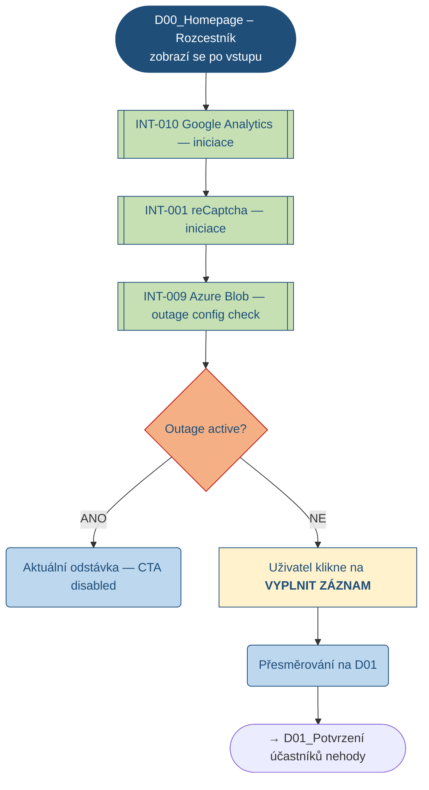

**Branches → TCs:**
- happy path → TC-CP-001 (PING already at D01 step; D00 is pre-step)
- outage active → TC-CP-019

---

## §2. D01 — Potvrzení účastníků nehody

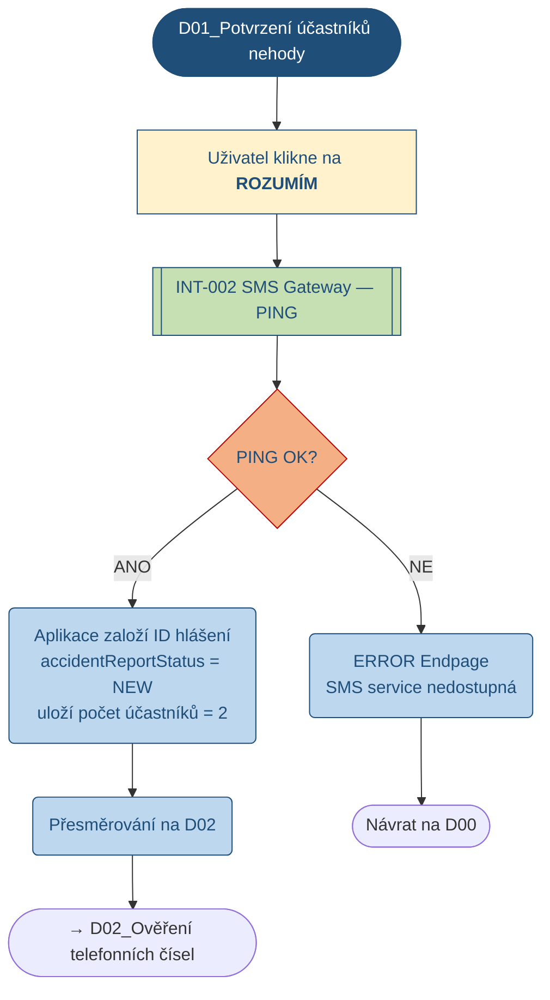

**Branches → TCs:** PING-OK = TC-CP-001 · PING-NOK = TC-CP-002

---

## §3. D02 — Ověření telefonních čísel

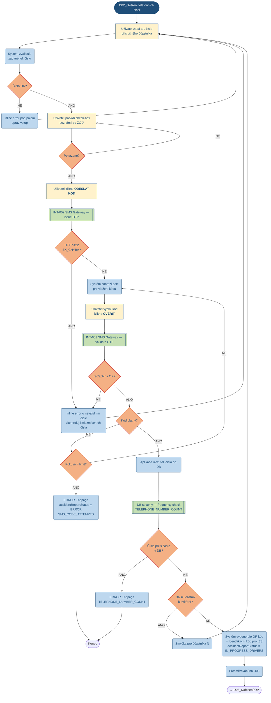

**Branches → TCs:** happy = TC-CP-003 · OTP retry = TC-CP-007 · attempts exhausted = TC-CP-004 · TELEPHONE_NUMBER_COUNT = TC-CP-005 · HTTP 422 EX_CHYBA = TC-CP-006

---

## §4. D03 — Nafocení OP a Osobní údaje – účastník A

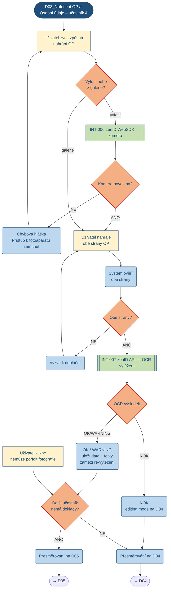

**Branches → TCs:** happy zenID = TC-CP-008 · zenID NOK manual = TC-CP-009 · camera-denied = TC-CP-011

---

## §5. D04 — Osobní údaje – účastník A

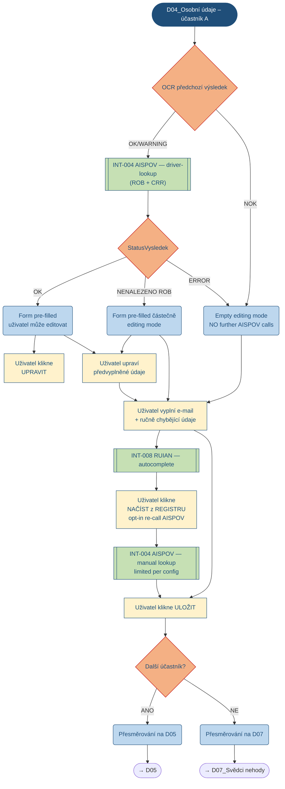

**Branches → TCs:** AISPOV OK = TC-CP-008 · AISPOV NENALEZENO ROB = TC-CP-010 · manual + button = TC-CP-009

---

## §6. D05 — Nafocení OP – účastník N · §7. D06 — Osobní údaje – účastník N

**Identical flow to D03 + D04 respectively, but for participant N.**
The "no further AISPOV calls" branch from D04 is honoured — if the
first participant's AISPOV came back empty, D06 jumps straight to
empty editing mode without re-calling AISPOV.

Mermaid diagrams omitted (copy D03 / D04 with `účastník A → účastník N`).

**Branches → TCs:** all subsumed under TC-CP-008/009/010 — one execution per participant slot.

---

## §8. D07 — Svědci nehody

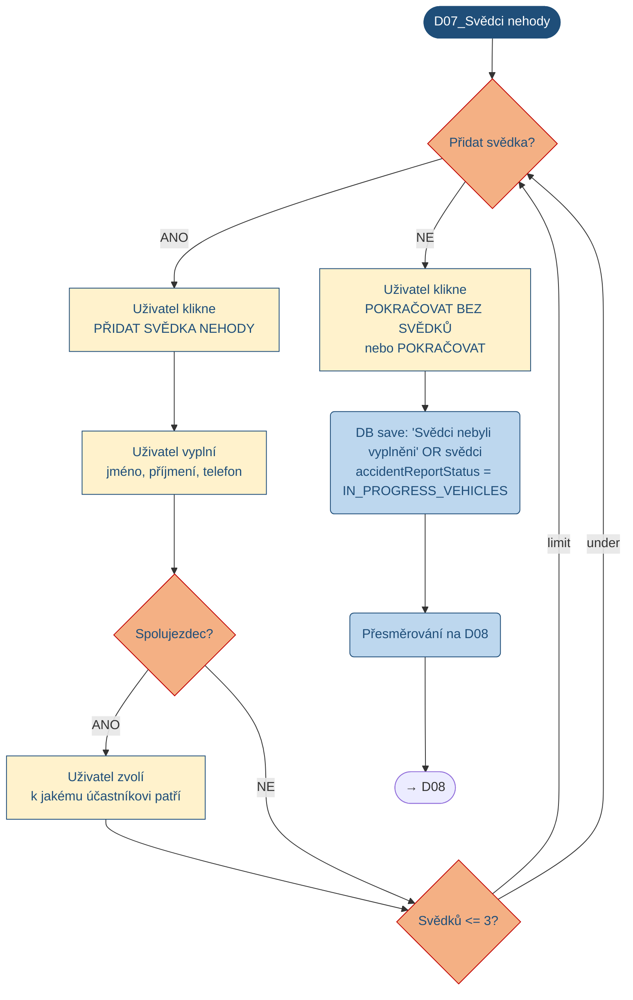

**Branches → TCs:** R2 (TT-CP-R2-WITNESS) — not in current R1 envelope.

---

## §9. D08 — Nafocení nehody + SPZ – informace o vozidle A

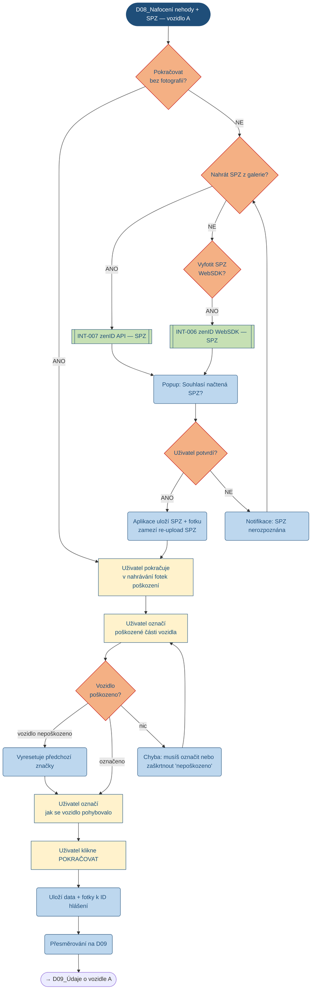

**Branches → TCs:** SPZ happy = TC-CP-012 · SPZ gallery fallback = TC-CP-013

---

## §10. D09 — Údaje o vozidle - vozidlo A

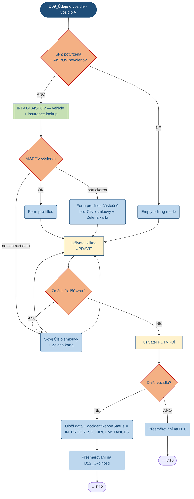

**Branches → TCs:** vehicle happy = TC-CP-012 · vehicle missing = TC-CP-014

---

## §11. D10 / D11 — Vehicle / vehicle data for participant N

Same shape as D08 + D09 for participant N's vehicle. R2-deferred
(TT-CP-R2-VEHICLE-N) but exercised by TC-CP-018 E2E orchestration.

---

## §12. D12 — Okolnosti nehody

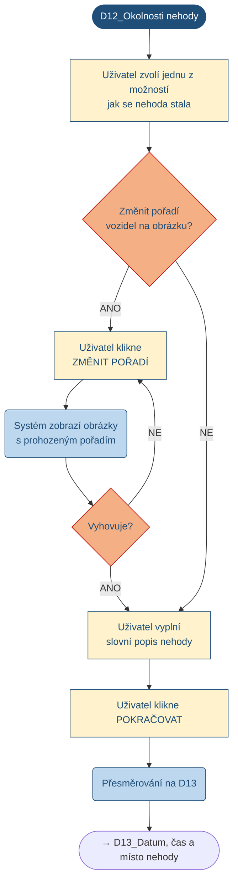

---

## §13. D13 — Datum, čas a místo nehody

(Pattern: GPS or manual address; map vs RUIAN autocomplete; two
date-pickers; continue → D14.)

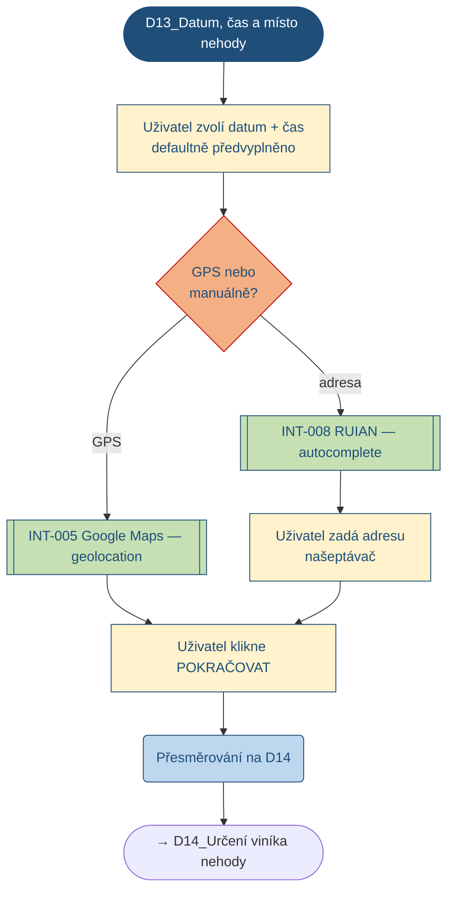

---

## §14. D14 — Určení viníka nehody

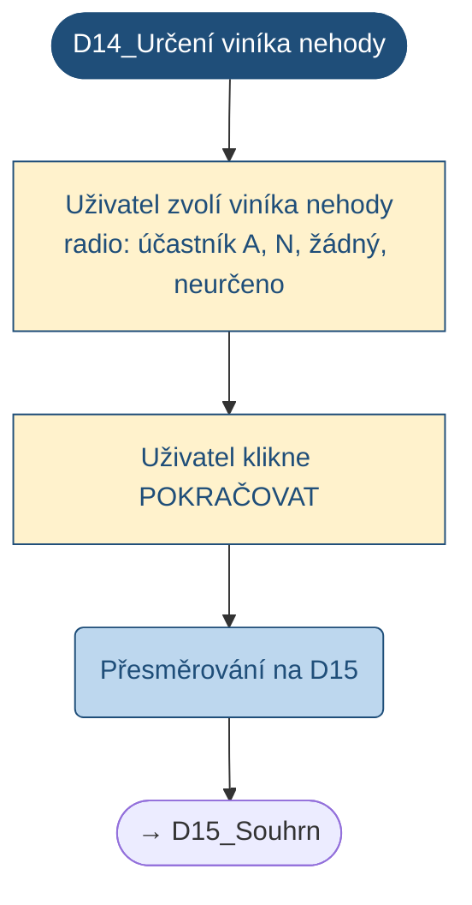

---

## §15. D15 — Souhrn a potvrzení zadaných údajů

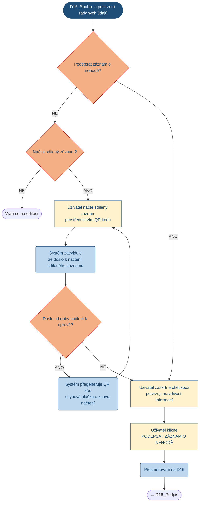

**Branches → TCs:** sign = TC-CP-015 · shared-record = TT-CP-R2-SHARED · re-edit reset = R2

---

## §16. D16 — Podpis účastníků pomocí SMS

(Mirrors D02 phone-OTP flow but for the *sign* step. Same retry logic,
same exhaustion → ERROR, but with different sub-reason `SIGN_OTP_ATTEMPTS`.)

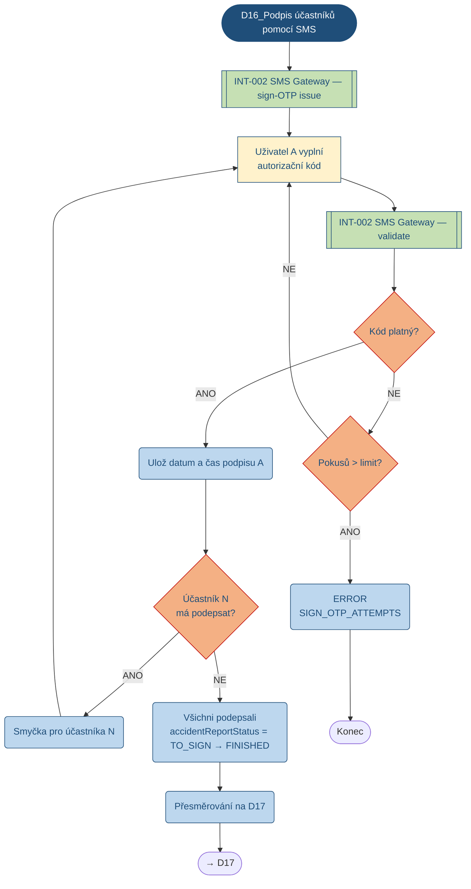

**Branches → TCs:** happy = TC-CP-015 · exhaustion = TC-CP-016 · timeout retry = TC-CP-017

---

## §17. D17 — Potvrzení a odeslání na email

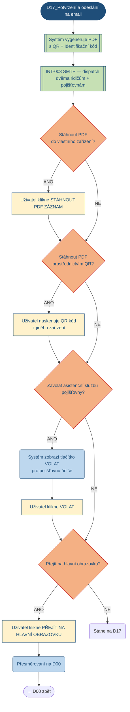

**Branches → TCs:** PDF dispatch = TC-CP-015 happy continuation · all post-sign branches = R2 (TT-CP-R2-SHARED)

---

## §18. Cross-cutting flows

These appear inline in multiple D-screens rather than as standalone
diagrams:

| Flow | Where it appears | Mapped to TC |
|------|------------------|--------------|
| Outage active (red box, CTA disabled) | D00 | TC-CP-019 |
| Outage warning (yellow box) | D00 | R2 (TT-CP-R2-OUTAGE-WARN) |
| Cookie banner (first visit) | D00 + LandingPage | R2 (TT-CP-R2-COOKIE) |
| Sdílený záznam (link/QR for participant N) | D15, D16 | R2 (TT-CP-R2-SHARED) |
| In-app sidebar Menu navigation + Začít znovu confirmation | every D-screen | R2 (TT-CP-R2-MENU) |
| Mid-wizard police-call self-disclosure (interlock fires) | D12 / D14 | TC-CP-020 |

---

## §19. Coverage check (extracted from §1–§17 + §18)

Every decision diamond in every diagram is a branch the test suite
must cover. Cross-check against `02_TestCases` lives in
`recon/COVERAGE-GAP-ANALYSIS.md` (sibling). Summary:

| Branch class | Diagram | Mapped TC | R-coverage |
|--------------|---------|-----------|:----------:|
| Outage check | D00 | TC-CP-019 | R1 |
| PING gate | D01 | TC-CP-001 / 002 | R1 |
| Phone validation | D02 | TC-CP-003 / 004 / 005 / 006 / 007 | R1 |
| OP camera vs gallery | D03 / D05 | TC-CP-008 / 009 / 011 | R1 |
| zenID OCR outcome | D03 / D05 | TC-CP-008 / 009 | R1 |
| AISPOV ROB outcome | D04 / D06 | TC-CP-008 / 009 / 010 | R1 |
| Witness add | D07 | (R2 TT-CP-R2-WITNESS) | R2 |
| SPZ camera vs gallery | D08 / D10 | TC-CP-012 / 013 | R1 |
| AISPOV vehicle outcome | D09 / D11 | TC-CP-012 / 014 | R1 |
| Damage marking | D08 / D10 | TC-CP-012 (sub-step) | R1 |
| Vehicle order swap | D12 | NOT YET COVERED | **gap** → TC-CP-021 cand. |
| GPS vs address | D13 | TC-CP-018 (E2E) only | gap → TC-CP-022 cand. |
| Fault attribution | D14 | TC-CP-018 (E2E) only | gap → TC-CP-023 cand. |
| Confirmation checkbox | D15 | TC-CP-015 | R1 |
| Shared-record load | D15 | (R2 TT-CP-R2-SHARED) | R2 |
| SMS sign retry | D16 | TC-CP-016 / 017 | R1 |
| PDF dispatch | D17 | TC-CP-015 | R1 |
| QR scan / asistence call / hlavní obrazovka | D17 | (post-FINISHED — R2) | R2 |

**Gaps surfaced for CP-SUPIN-03 to address:**
- TC-CP-021 — D12 vehicle-order-swap branch
- TC-CP-022 — D13 GPS vs manual-address branch (currently only inside E2E)
- TC-CP-023 — D14 fault-attribution radio (currently only inside E2E)

These three become the **first new TCs in the next iteration** —
already declarable in Excel even before the SPECs are authored.

---

## §20. Status

| Item | Value |
|------|-------|
| Document | `recon/diagrams/extracted/ACTIVITY-DIAGRAMS-v0.1.md` |
| Source | 30 photos `IMG_1067..IMG_1096` of `SUPIN_DEMO_Bouracka` draw.io workbook |
| Diagrams extracted | 18 swimlanes (D00..D17) + 6 cross-cutting flows |
| Format | Mermaid `flowchart TB` (renders in any Markdown viewer with Mermaid support; GitHub, VS Code, MkDocs all OK) |
| Coverage gaps surfaced | 3 (TC-CP-021..023 candidates) |
| Coverage report | `recon/COVERAGE-GAP-ANALYSIS.md` (next file) |
| Status | v0.1 — review + use for TC revision in CP-SUPIN-03 |
